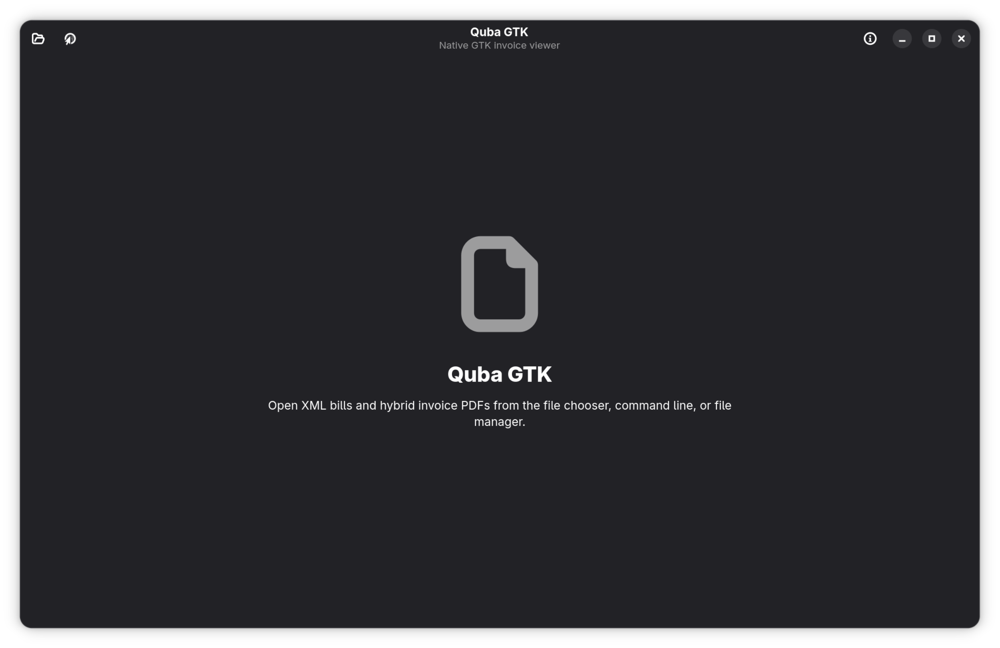
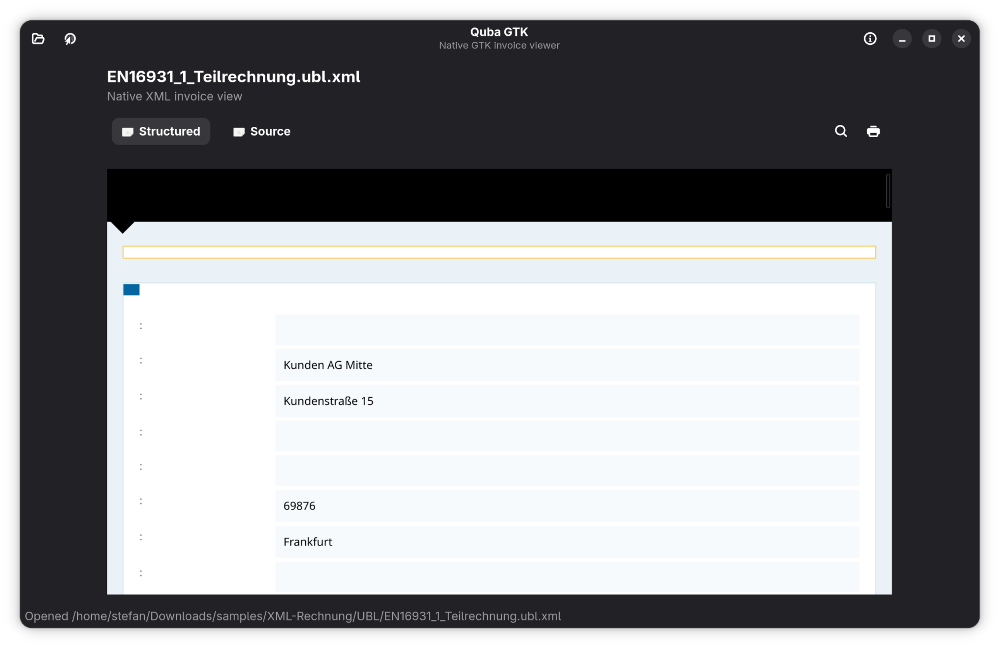
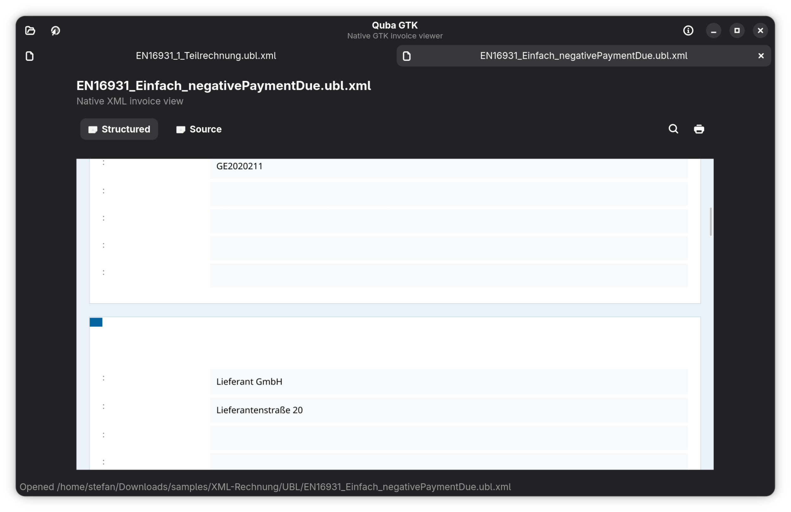

# Quba GTK

Quba GTK is a GTK4/libadwaita rewrite of [Quba](https://github.com/ZUGFeRD/quba-viewer), focused on opening XML invoices and hybrid invoice PDFs on Linux desktops.

It keeps the original Quba invoice transformation pipeline for structured invoice rendering, while replacing the Electron shell with a native Rust application that supports direct file opening, desktop integration, and Flatpak packaging.

## Features

- Open XML invoice documents directly.
- Open hybrid PDF invoices and extract embedded invoice XML.
- Show structured invoice output, raw source XML, and the original PDF where available.
- Support file-manager "Open With" integration through the desktop file.
- Use English or Romanian automatically based on the system locale.

## Screenshots







## Project Layout

- `src/`: Rust GTK4/libadwaita application.
- `dist/quba-render-helper.bundle.cjs`: bundled compatibility helper used for invoice rendering.
- `quba-viewer-1.5.0/`: bundled upstream Quba assets reused for invoice transformation and rendering.
- `data/`: desktop file and AppStream metadata.
- `flatpak/`: Flatpak manifest.
- `docs/PARITY.md`: feature-parity checklist against upstream Quba.

## Local Development

Requirements:

- Rust toolchain with Cargo
- Node.js and npm
- GTK4/libadwaita development packages
- WebKitGTK 6.0 development packages
- GtkSourceView 5 development packages

Install helper dependencies and rebuild the bundled helper:

```bash
npm install
npm run bundle-helper
```

Build and test the Rust application:

```bash
cargo build
cargo test
```

Install a local desktop-integrated build:

```bash
./scripts/install-local.sh
```

Launch it with:

```bash
gtk-launch org.zugferd.QubaViewer
```

## Flatpak

The Flatpak manifest lives at [`flatpak/org.zugferd.QubaViewer.json`](flatpak/org.zugferd.QubaViewer.json).

Build locally with:

```bash
flatpak-builder --user --install --force-clean flatpak/build-dir flatpak/org.zugferd.QubaViewer.json
```

Run the Flatpak with:

```bash
flatpak run org.zugferd.QubaViewer
```

Export a distributable bundle with:

```bash
flatpak build-export flatpak/repo flatpak/build-dir master
flatpak build-bundle flatpak/repo flatpak/Quba-GTK.flatpak org.zugferd.QubaViewer master
```

The Flatpak build is source-based: it installs a pinned Rust toolchain, uses vendored Cargo crates from `vendor/`, and bundles the prebuilt JavaScript helper artifact from `dist/`.

## Licensing

The rewrite code in this repository is licensed under GPL-3.0-or-later.

Bundled upstream Quba assets under `quba-viewer-1.5.0/` remain under Apache-2.0 and keep their original notices. That reused content is preserved because the native rewrite still depends on Quba's invoice transformation assets and compatibility logic.

This mixed distribution is intentional and compatible with GPLv3. The Apache Software Foundation FAQ states that Apache License 2.0 is compatible with GPL version 3, and the GNU license list says the same. See:

- https://www.apache.org/foundation/license-faq.html
- https://www.gnu.org/licenses/license-list.html

For a short repository-specific notice, see [`NOTICE`](NOTICE).

## Acknowledgement

This project includes AI-generated code made with OpenAI's Codex, reviewed and adapted for this rewrite.
